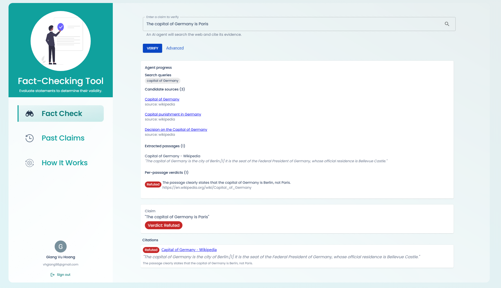

# Fact-Checking

An agent-driven fact-checking web app. You submit a natural-language claim and three LLM agents search the web, gather evidence, and return a verdict (`SUPPORTED` / `REFUTED` / `NOT_ENOUGH_INFO`) backed by citations. You watch the agents work in real time: every query, source, and judgement streams to the browser as it happens.

Live at **https://factchecking.dpdns.org** (when the demo cluster is running).



## How it works

A claim flows through a LangGraph pipeline of three agents, each powered by a local LLM (Ollama):

```
            ┌──────────────────┐    ┌─────────────────────┐    ┌──────────────────────┐
 claim ───▶ │ Document Search  │ ─▶ │ Evidence Retrieval  │ ─▶ │ Claim Verification   │ ─▶ verdict
            │ rephrase claim   │    │ fetch pages,        │    │ judge each passage,  │    + citations
            │ into queries,    │    │ extract relevant    │    │ majority vote        │
            │ pick engines     │    │ passages            │    │                      │
            └──────────────────┘    └─────────────────────┘    └──────────────────────┘
                     ▲                        │
                     └── retry (max 2) ◀── no evidence found
```

1. **Document Search** — the LLM rephrases the claim into 1–3 search queries and chooses search engines (Wikipedia, DuckDuckGo and Brave).
2. **Evidence Retrieval** — candidate URLs are fetched concurrently; for each page the LLM extracts the sentences most relevant to the claim.
3. **Claim Verification** — the LLM judges entailment per passage; a majority vote across passages produces the final verdict.

If no evidence is found, the graph loops back to search (up to 2 retries) before giving up with `NOT_ENOUGH_INFO`.

The pipeline streams named Server-Sent Events as it runs; the React client renders an agent timeline that fills in live, so you see *why* the verdict is what it is, not just the answer.

## Design highlights

- **Spec-first contract** — the whole API, including every SSE payload, is defined once in `api/openapi.yaml`; Pydantic models and TypeScript types are both generated from it, so the two ends cannot drift. → [`api/`](api/README.md)
- **Typed SSE on both ends** — a backend registry pins each event name to its payload model, mirrored by a frontend type map with a compile-time exhaustiveness guard; adding an event without a payload breaks the build. → [`server/`](server/README.md), [`web-client/`](web-client/README.md)
- **Agentic retry** — the LangGraph state machine loops back to search with fresh queries when retrieval comes up empty, instead of failing on the first miss. → [`server/`](server/README.md)
- **Full IaC deployment** — Terraform-provisioned AKS behind the Kubernetes Gateway API with automatic Let's Encrypt TLS, budget alerts, and stop/start scripts. → [`infra/`](infra/README.md)

## Tech stack

| Layer | Technology |
|---|---|
| LLM runtime | Ollama (default model `qwen2.5:7b-instruct`) |
| Agents | LangGraph + LangChain |
| Backend | FastAPI · Pydantic v2 · SQLite · sse-starlette |
| Frontend | React 18 · Redux Toolkit · MUI v5 · Vite · TypeScript (strict) |
| Auth | Google OAuth 2.0 + JWT cookies |
| Contract | OpenAPI 3.1 → `datamodel-codegen` (Python) + `openapi-typescript` (TS) |
| Infra | Docker Compose (local) · Terraform + AKS + Gateway API (cloud) |

## Run it locally

Requires Docker with Compose v2, and **Google OAuth credentials** (the app has a login screen — create an OAuth client in [Google Cloud Console](https://console.cloud.google.com) and put the ID/secret in `server/.env`; details in [`server/README.md`](server/README.md)).

```bash
docker compose up -d --build
# First run downloads qwen2.5:7b-instruct (~4.7 GB). A GPU helps; CPU works but is slow.
```

Open **http://localhost**. The API is at `http://localhost:8000` (Swagger UI at `/docs`).

For native development with hot reload (Ollama in Docker, server/client on the host), see [`server/README.md`](server/README.md) and [`web-client/README.md`](web-client/README.md).

## Repo layout

| Path | Purpose |
|---|---|
| [`api/`](api/README.md) | OpenAPI spec + codegen tooling. Single source of truth for the public contract. |
| [`server/`](server/README.md) | FastAPI + LangGraph + Ollama backend — agents, config, tests. |
| [`web-client/`](web-client/README.md) | React + Redux web client — streaming, type safety. |
| [`infra/`](infra/README.md) | Terraform (AKS cluster) + Kubernetes manifests + deployment. |
| `docker-compose.yml` | Full-stack local run (Ollama + server + web). |
